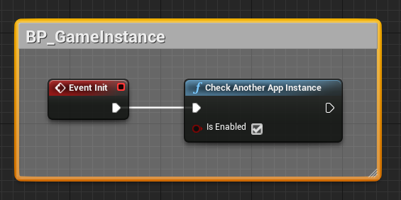

# CheckAppInstance
Plugin for UE4 project.  
This plugin makes it possible only one instance of your game can be run at the same time.
This plugin created mostly who don't like C++ and work only with blueprints.

# Install
1. https://www.unrealengine.com/marketplace/en-US/product/checkappinstance  
or manual unzip CheckAppInstance-X.X.X-build-win64-ueX.XX.X.zip from  
https://github.com/mrbindraw/CheckAppInstance/releases into ROOT_UE4\Engine\Plugins.
2. Create Blueprint class BP_GameInstance derived from GameInstance.
3. Call on EventInit method CheckAnotherAppInstance.
4. ProjectSettings -> Maps&Modes -> Game Instance Class: BP_GameInstance.

**C++/Blueprints functions:**
- CheckAnotherAppInstance(bool IsEnabled = true)

